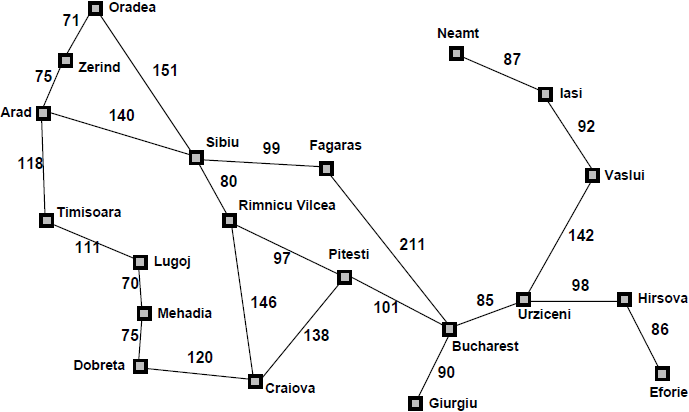

```{r setup, include=FALSE}
knitr::opts_chunk$set(echo = TRUE)
```

# Intro
This unit deals with problem solving, the theory and technology of building agents that can plan ahead to solve problems. In particular problems with many states, e.g. navigation problem, where there are many choices to start with and the complexity is picking the right choice from start and at every intersection. 

## Formal Definition of a problem

The definition of a problem can be broken down into a number of components

1. INITIAL STATE: The initial state that the agent starts out with
2. ACTION (A Function): that takes a state as input and returns a set of possible actions that the agent can execute
3. RESULT (A Function): which takes as input a state and an action and as output returns a new state
4. Goal Test (A Function): which takes a state and returns a boolean value true or false telling whether the given state is the goal or not.
5. Path Cost (A Function): which takes a path (sequence of state action transitions) and returns a number which is the cost of that path

### Mapping of definition of problem to route finding domain



The set of all cities on the map is the **state space**

1. Initial State:  Arad, and assume that the goal state is Bucharest
2. Starting with **Arad**, we can expand by adding a path of length one in 3 different ways:  
   2.1  **Zerind**  
   2.2  **Sibiu**  
   2.3  **Timisoara**  
3. Expanding further
   3.1  **Oradea**
   3.2  **Rimnicu Vilcea**
   3.3  **Lugoj**
4. At every point the states can be separated into three regions:  
   4.1. The ends of the paths that have been explored called **frontiers**, e.g. { Oradea, Rimnicu Vilcea, Lugoj}  are at the frontier.  
   4.2. All states to the left of the frontier are located in **explored** region.  
   4.3. All states to the right of the frontier are located in **unexplored** region.  
5. A **step cost** has been mentioned alongth the paths, e.g. Arad to Zerind is 75. **Path cost** is the sum of the step cost e.g. path cost from Arad to Oradea would be 75 + 71.  

### Graph Search: A function for solving the problem

```{r, highlight=TRUE, eval=FALSE}
Function GraphSearch():
  frontier = {{Initial}}, explored = {};
  loop:
    if frontier is empty:
      return FAIL;
    path = remove_choice(frontier)
    s = path.end;
    add s to explored
    if s is the goal:
      return path;
    for a in actions:
      add path + a ==> result(s,a) to frontier unless result(s,a) in frontier or explored
```
